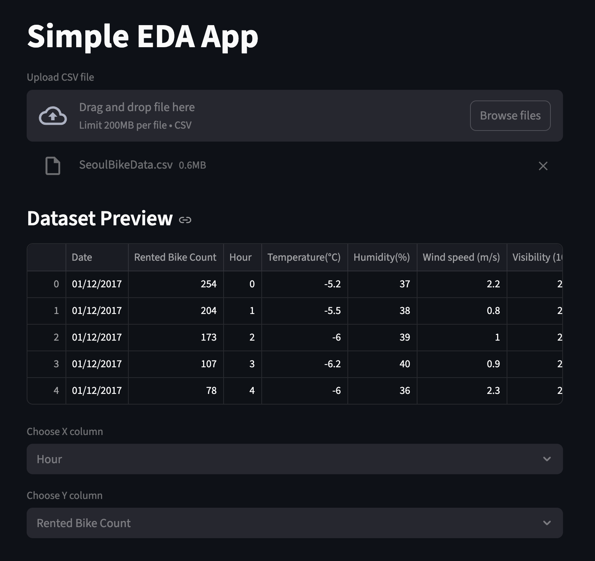
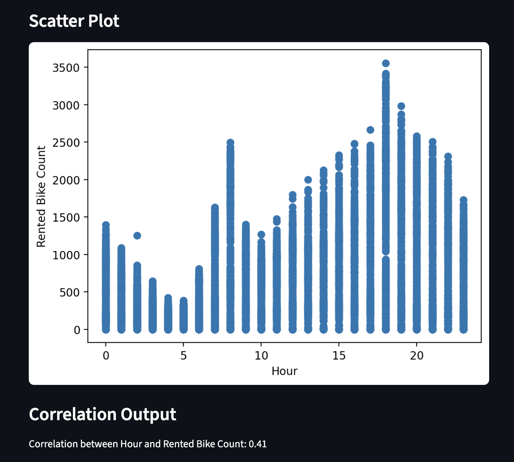

# Streamlit EDA App

This is a simple exploratory data analysis app built with Streamlit.

## Features
- Upload a CSV file
- Select two numeric columns
- View a scatter plot
- View correlation between the two columns

## Files
- app.py
- requirements.txt
- README.md

## How to run

Install the packages:

pip install -r requirements.txt

Run the app:

streamlit run app.py

## App Screenshots

### Upload and Dataset Preview

### Scatter Plot and Correlation Output

